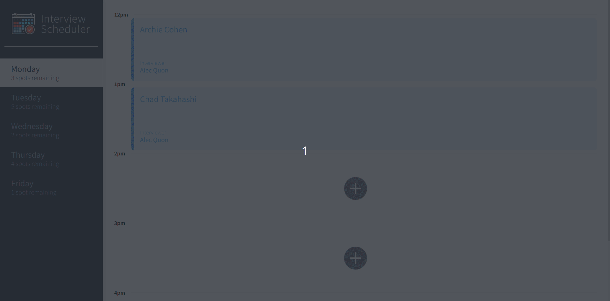
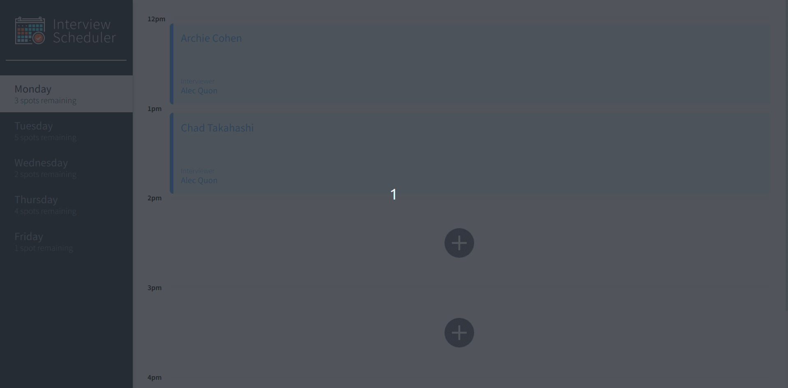

# Interview Scheduler

**Scheduler is a single-page React app that allows students to book and cancel interviews with mentors.**

The application comes with a variety of environments for testing functionality. Components were built and tested using Storybook.

## Project Screenshots

### Select Day



### Add Appointment



### Edit Appointment


### Delete Appointment


## Tech Stack


## Installation

1. Clone this repository.
   `$ git clone https://github.com/JackDuluoz/scheduler`

2. Run `npm install` from the root directory of the project.

```bash
$ cd scheduler
$ npm install
```

3. You will need to set up the server independantly using [scheduler-api](https://github.com/JackDuluoz/scheduler-api).

4. Start the front end from the root directory of the project.

```sh
npm start
```

5. To run the `Jest` testing framework, use:

```sh
npm test
```

6. Or to run `Storybook` visual testbed, use:

```sh
npm run storybook
```

## Author

Michael Green [@michaelgreen](https://github.com/JackDuluoz)

## Acknowledgements

Thanks to all the mentors at Lighthouse Labs who assisted me during this project.
